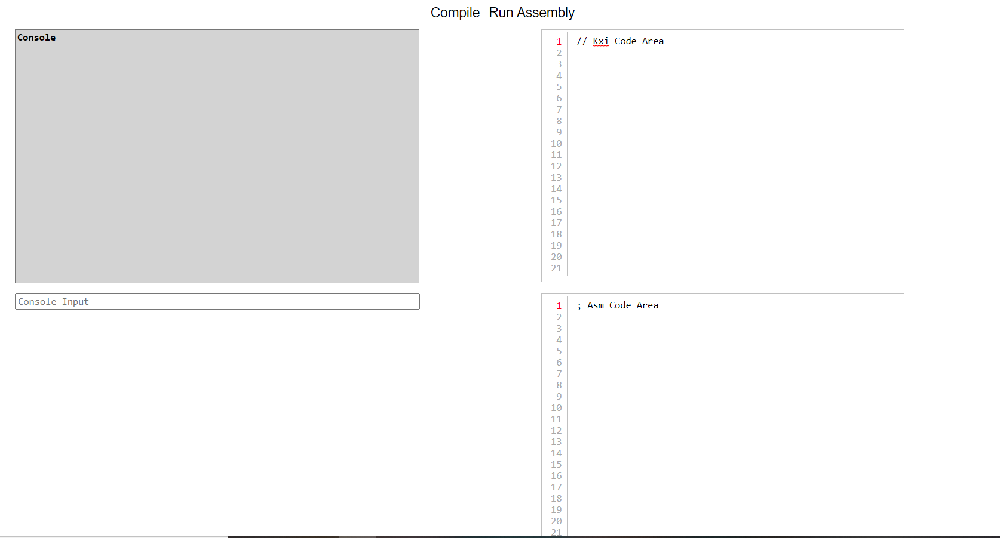
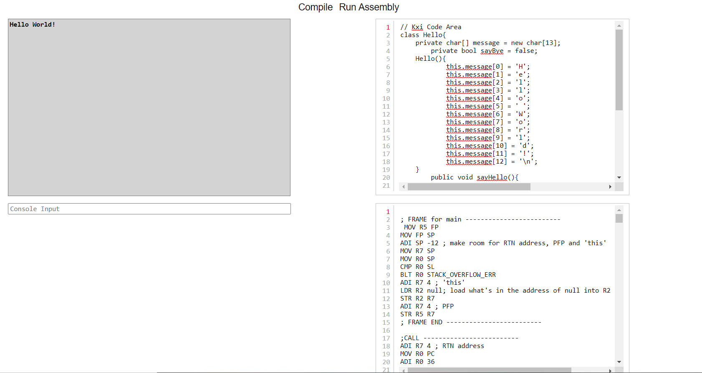
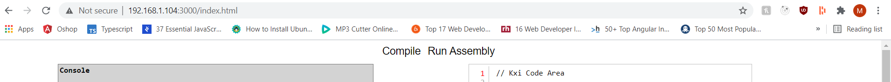

# Browser-Compiler-Dummy-Repo
Describes the Compiler that's in the browser which is public

Note: To see how I made a compiler, refer to Compiler-Dummy-Repo and for the virtual machine to Virtual-Machine-Dummy-Repo

Using the same compiler I made for the KXI programming language, I placed it on the browser. Everything is the same except you now have a GUI on the browser to run the compiler instead of running it from the command line which is what you had to do previously. The virtual machine to execute assembly will also show up on the GUI so you can see the compiler and virtual machine working side by side.

In the screenshot below you can see a console, a text area for writing kxi, a text area for writing assembly and an input field. Once you compile the kxi code, the compiler will write the assembly which you can then run to see the results on the console. You can even write assembly code and execute that as well without using the compiler. When compiling, any syntax or semantic errors will show on the console.

## Hello World

Also note that I have set up a node.js server which is serving the Browser-Compiler at my LAN

